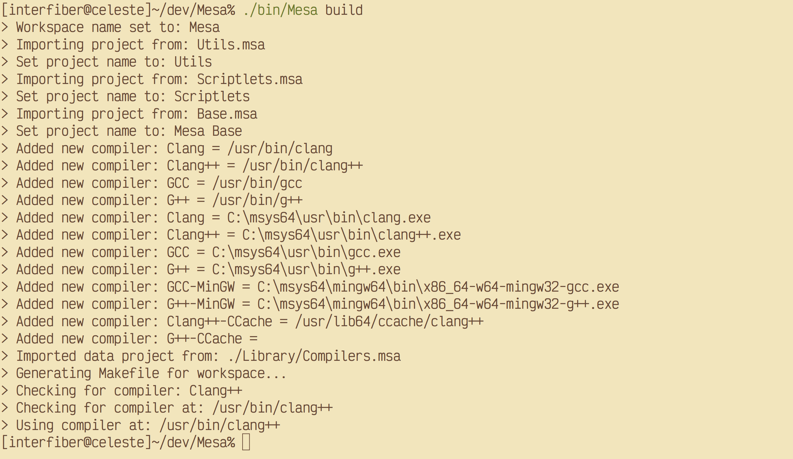
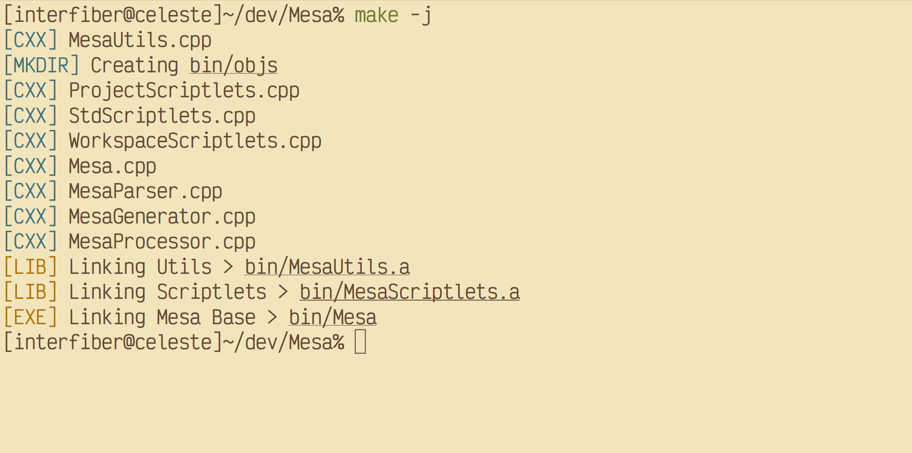
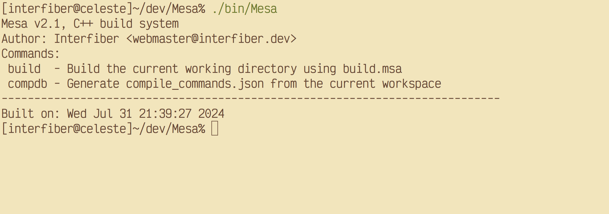

# Mesa
C++ buildsystem & Makefile generator

## Why?
* Mesa is simple
* Mesa generates portable Makefiles! Makefiles generated by Mesa can be used on any system(except windows)
* Mesa is cross-platform
* Mesa is fast
* Mesa can integrate into any IDE setup by generating ```compile_commands.json``` from the build
* Mesa is easy to hack & modify
* Mesa is not CMake

## Building
The ```Makefile``` in this repo will build Mesa, the built executable will be located at ```bin/Mesa```

## Screenshots




