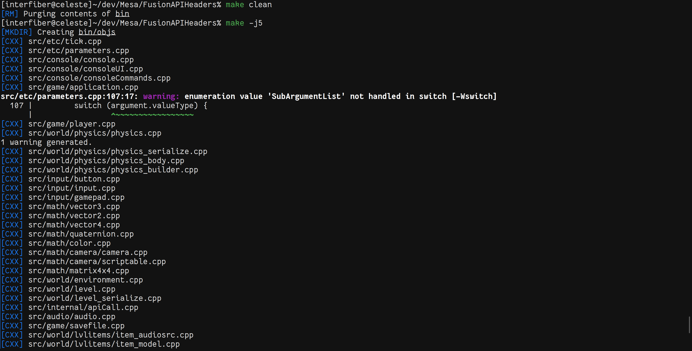

# Mesa
IBAtechSoftware C++ buildsystem

## Why?
* I don't want to package CMake with the SDK
* Generates an stand-alone Makefile
* Simple to configure

## Building
The ```Makefile``` in this repo will build Mesa, the built executable will be located at ```bin/Mesa```

## Screenshot

